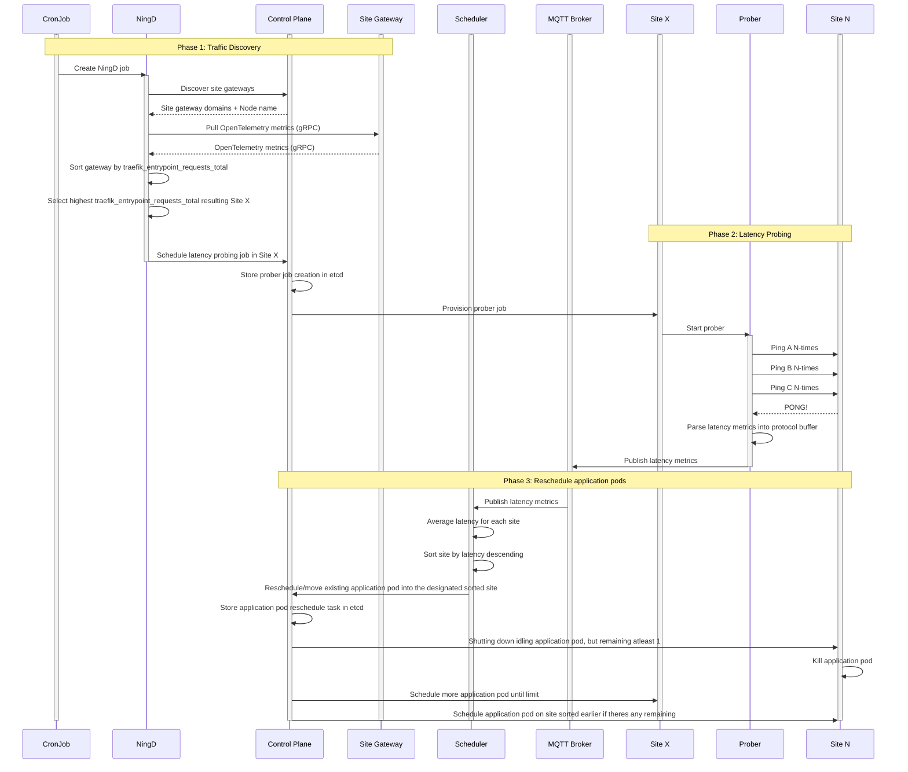

> [!CAUTION]
> The project is still under active development. I am not responsible for any damage caused by this 
prototype. Please consider creating an issue if you have any questions.

## TLDR

Kubernetes scheduling algorithm based on latency metric received by measuring ping latency of a 
high traffic client within the specified time context.



## How to run?

### Prerequisite

- [docker](https://www.docker.com/)
- [kind](https://kind.sigs.k8s.io/)
- kubectl
- [helm](https://helm.sh/)

### Setup

The base environment can be runned with a single make command below:
```shell
make all
```

