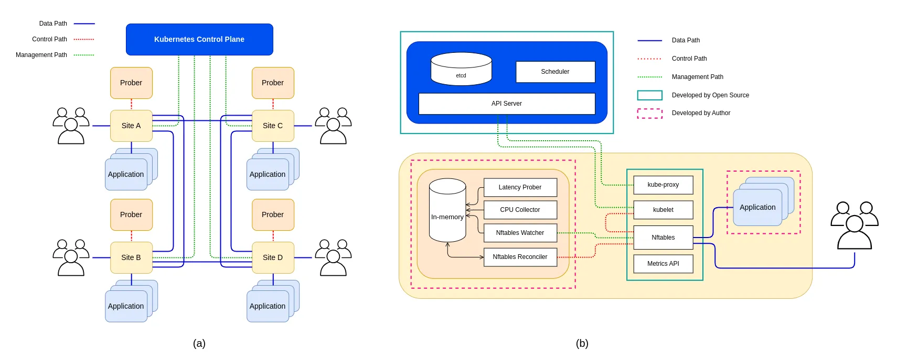
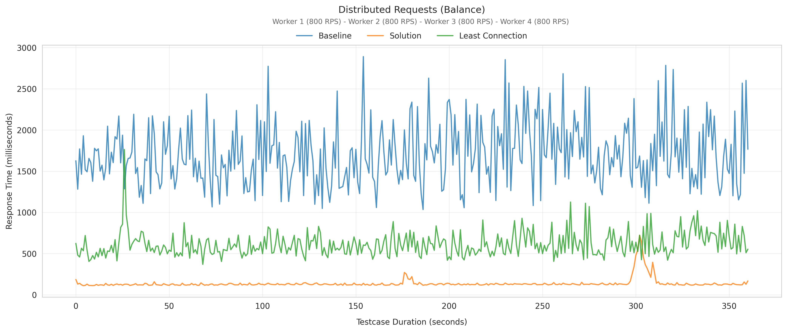
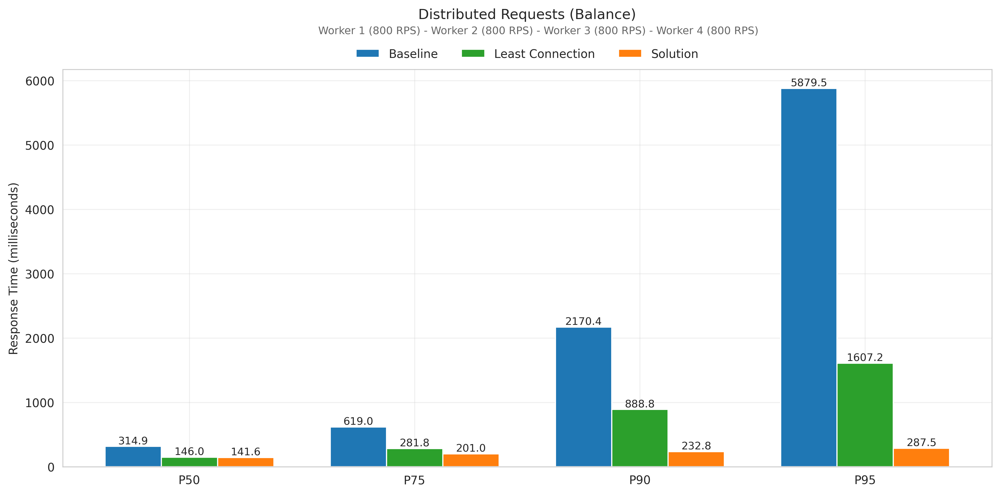
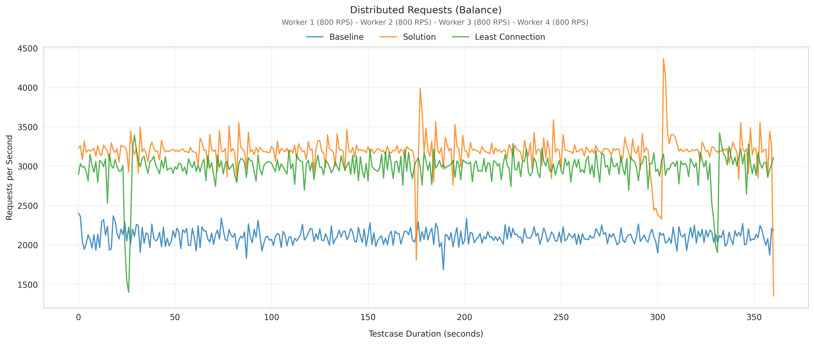
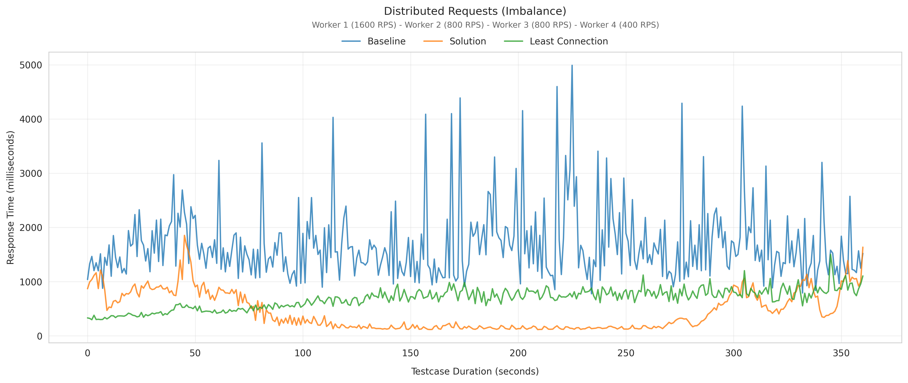
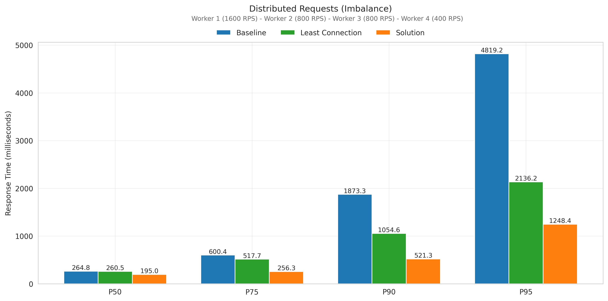
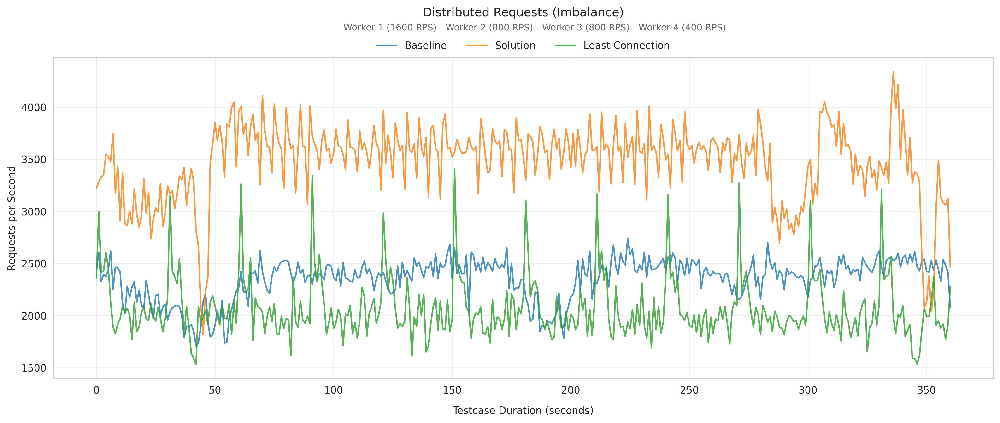
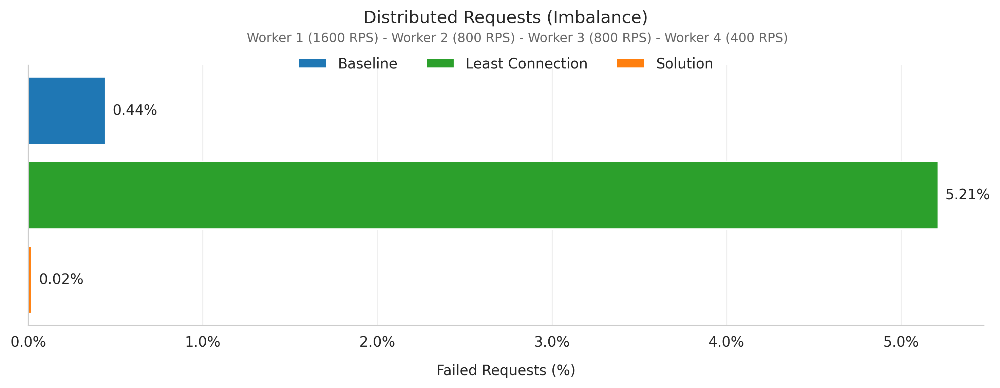

> [!CAUTION]
> The project is still under active development. Authors ARE NOT responsible for any damage caused 
by this prototype. Please consider creating an issue if you have any questions.

## TLDR
A custom Kubernetes scheduler and load balancer that uses an EWMA-based
algorithm to balance node resource usage with network latency. This results in
smarter pod placement closer to end-users and traffic routing to the most
capable, low-latency nodes.

## Architecture

The traffic types illustrated in the legend (Control, Data, and Management Path) are defined
according to
[RFC 7426 – Software-Defined Networking (SDN), Section 3.1](https://datatracker.ietf.org/doc/html/rfc7426#section-3.1).

## Performance

### Balanced Requests

### Imbalanced Requests

## License
This project is licensed under the GNU Affero General Public License v3.0
License - see the [LICENSE](LICENSE) file for details.
